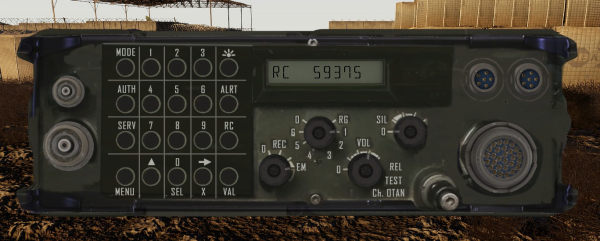
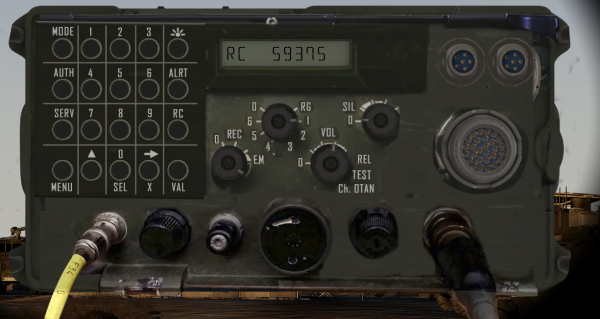
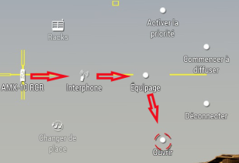
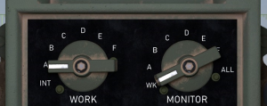
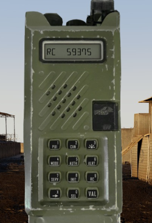

# PR4G/ER314 (radio operator)

Only RC mode is supported (unencrypted fixed frequency).

Change channel : Central switch (RG, 1 - 6, 0) 

Change frequency of the current channel:
   - Press RC
   - Enter the frequency (**X ➞** allows you to correct input)
   - Press VAL 

Change volume : Switch 

# PR4G/ER315 (Vehicle racked) 

Most ground vehicles are pre-equipped with a PR4G/ER315.

It is not active by default. It is necessary either to activate it on the intercom or to use it via the ACE interaction menu.
  * If the vehicle is equipped with an intercom
    - Open the vehicle's ACE menu, i.e. by holding down the **⊞ Windows** key
    - Go to "Intercom", "Crew" then "Open" 
    - Toggle the "Work" switch to "A" by clicking on it  
    - Exit with the **Esc** key
    - Adjust the radio via the ACE interaction menu (**Ctrl** + **⊞ Windows**) by going to "Radio"
  * Otherwise, if the vehicle does not have an intercom
    - Open the vehicle's ACE menu, i.e. by holding down the **⊞ Windows** key
    - Go to "Racks", "Dashboard" then "Use"
    - Adjust the radio via the ACE interaction menu (**Ctrl** + **⊞ Windows**) by going to "Radio"

The use of the radio is identical to the PR4G/ER314. 

# PR4G/ER350 (Squad leader, Platoon leader)

Only RC mode is supported (unencrypted fixed frequency).

Change channel :
   - Press **2 CH**
   - Enter the channel number (**X ➞** allows you to correct input)
   - Press **VAL**

Change frequency of the current channel:
   - Press **9 RC**
   - Enter the frequency (**X ➞** allows you to correct input)
   - Press **VAL**

Chnage volume: Switch at the top of the radio 
