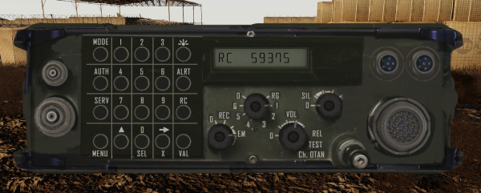
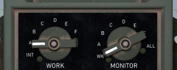
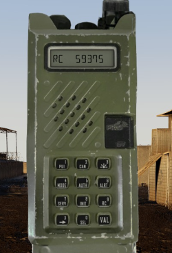

# PR4G/ER314 (Opérateur radio)

Seul le mode RC est pris en charge (fréquence fixe non chiffrée).

Changement de canal : Commutateur central (RG, 1 - 6, 0) 

Modification de la fréquence du canal courant :
  - Appuyer sur RC
  - Saisir la fréquence (**X ➞** permet de corriger la saisie)
  - Appuyer sur VAL

Modification du volume : Commutateur

# PR4G/ER315 (Racké dans les véhicules) 

La plupart des véhicules terrestres sont pré-équipés d'une PR4G/ER315.

Elle n'est pas active par défaut. Il est nécessaire soit de l'activer sur l'interphone ou de l'utiliser via le menu d’interaction ACE.
  * Si le véhicule est équipe d'un interphone
    - Ouvrir le menu ACE du véhicule, c'est à dire en maintenant appuyé la touche **⊞ Windows**
    - Aller dans "Interphone", "Équipage" puis "Ouvrir"  
    - Basculer le commutateur "Work" sur "A" en cliquant dessus  
    - Sortir avec la touche **Echap**
    - Régler la radio via le menu d’interaction ACE (**Ctrl** + **⊞ Windows**) en allant dans "Radio" 
  * Sinon, si le véhicule n'a pas d'interphone
    - Ouvrir le menu ACE du véhicule, c'est à dire en maintenant appuyé la touche **⊞ Windows**
    - Aller dans "Racks", "Tableau de bord" puis "Utiliser"
    - Régler la radio via le menu d’interaction ACE (**Ctrl** + **⊞ Windows**) en allant dans "Radio" 

L'utilisation de la radio est identique à la PR4G/ER314.

# PR4G/ER350 (Chef de groupe, Chef de section)

Seul le mode RC est pris en charge (fréquence fixe non chiffrée).

Changement de canal : 
  - Appuyer sur **2 CAN**
  - Saisir le numéro de canal (**X ➞** permet de corriger la saisie)
  - Appuyer sur **VAL**

Modification de la fréquence du canal courant :
  - Appuyer sur **9 RC**
  - Saisir la fréquence (**X ➞** permet de corriger la saisie)
  - Appuyer sur **VAL**

Modification du volume : Commutateur en haut du poste